# Azure-AI-Resume-Screener

An intelligent, serverless application that automates resume screening by analyzing how well candidate resumes match a job description. The tool extracts text from files, performs keyword matching, and calculates a semantic similarity score using AI.

### Here's how it works

▸ The backend runs completely serverless using *Azure Functions*, meaning it handles file ingestion endpoints, api orchestration, and resource routing dynamically without managing physical servers.

▸ Text extraction is handled by *Azure AI Document Intelligence* using its prebuilt read model. Instead of extracting a giant, messy block of text, it uses **advanced OCR** to read documents with high fidelity, keeping text structure intact.  

▸ Alignment scoring is handled via *Azure OpenAI (GPT-4.1-mini)* using a strict **dual-layer evaluation script**. It calculates exact matches for required technologies while analyzing experience timelines and core technical depth.  

▸ Beyond keyword matching, the tool evaluates candidate alignment using **text-embedding models**. It converts text into **numerical vectors** and calculates a **cosine similarity metric**, ensuring candidates are evaluated on overall meaning rather than just exact keywords.  

▸ All file data is persistent and secure. Uploaded documents are saved in a raw data container inside *Azure Blob Storage*, while the final calculated analytics reports are instantly saved into a designated reports container for clean audit trails.

### Project architecture

  

### Tech Stack

1. Cloud & Serverless: Azure Functions, Azure Blob Storage, REST APIs  

2. AI & Document Intelligence: Azure OpenAI (GPT-4.1-mini & Text Embeddings), Azure AI Document Intelligence  

3. Core Backend: Python, NumPy, Requests  

4. Frontend UI: HTML5, CSS3, JavaScript
